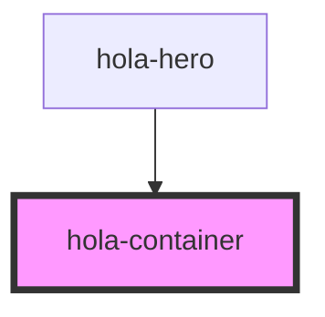

# hola-container

There's nothing to talk about about `<hola-container>`. It's just like would you would use as a `div.container` in other frameworks. This component implements a horizonal limitation for the whole page to make sure your website won't be too wide across all devices.

Notice that `<hola-container>` shouldn't be put around `<hola-hero>`, `<hola-navbar>` or `<hola-footer>`. They're designed to be full-width and they do have a container built in for inner contents.

<!-- Auto Generated Below -->

## Dependencies

### Used by

 - [hola-hero](../hola-hero)

### Graph

----------------------------------------------

*Built with [StencilJS](https://stenciljs.com/)*
