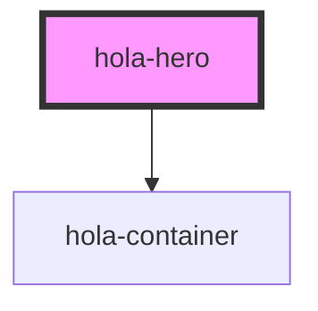

# hola-hero

Hero is mostly used on home pages and landing pages, which usually contains a slogan, a subtitle and a call-to-action [ghost button](hola-button.md). In Holakit's design, the bottom of hero in extended behind cards after hero.

Of course you can set a background image as the background. With a prop `light-bg` indicating light background image/color, dark text and button will be used to improve contrast.

```html
<!--Use `light-bg` to use dark fonts.-->
<hola-hero light-bg>
  <h1>Holakit</h1>
  <p>Another design-driven UI component set.</p>
  <hola-button ghost>Getting Started</hola-button>
</hola-hero>
```

<!-- Auto Generated Below -->


## CSS Custom Properties

| Name                           | Description                                      |
| ------------------------------ | ------------------------------------------------ |
| `--hola-hero-extend-height`    | The amount of height the hero will extend after. |
| `--hola-hero-min-height`       | Minimum height of content to keep.               |
| `--hola-hero-vertical-padding` | Padding at top and bottom.                       |


## Dependencies

### Depends on

- [hola-container](../hola-container)

### Graph


----------------------------------------------

*Built with [StencilJS](https://stenciljs.com/)*
